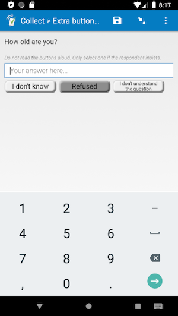
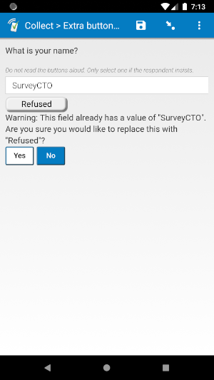

# Extra button

 

## Description

Use this field plug-in to add extra buttons to your text, integer, or decimal field. When a button is selected, the field will automatically advance. If there is already something in the text box when pressing a button, a warning message will confirm if you would like to replace what you already have. You can specify exactly what each button says, and what its value should be (for example, you can specify that when "I don't know" is selected, then the field has a value of -99). You can use the parameters to specify as many buttons as you would like.

The default warning message is:
>Warning: This field already has a value of "[old value]". Are you sure you would like to replace this with "[replacement]"?

However, it can be customized using the **Parameters** (see below).

## Default SurveyCTO feature support

| Feature / Property | Support |
| --- | --- |
| Supported field type(s) | `text`, `integer`, `decimal`|
| Default values | Yes |
| Custom constraint message | Yes |
| Custom required message | Yes |
| Read only | Yes |
| media:image | Yes |
| media:audio | Yes |
| media:video | Yes |
| `number` appearance | Yes |
| `numbers_decimal` appearance | Yes |
| `numbers_phone` appearance | Yes |
| `show_formatted` appearance | Yes |

## How to use

**To use this field plug-in as-is**, just download the [extrabuttons.fieldplugin.zip](extrabuttons.fieldplugin.zip) file from this repo, and attach it to your form.

To create your own field plug-in using this as a template, follow these steps:

1. Fork this repo
1. Make changes to the files in the `source` directory.

    * **Note:** be sure to update the `manifest.json` file as well.

1. Zip the updated contents of the `source` directory.
1. Rename the .zip file to *yourpluginname*.fieldplugin.zip (replace *yourpluginname* with the name you want to use for your field plug-in).
1. You may then attach your new .fieldplugin.zip file to your form as normal.

## Parameters

The first three parameters are for the warning message: The first is the actual warning message, the second is the text of the "Yes" button, and the third is the display of the "No" button. For the message, you can even include the current value and the replacement value in the warning message. Similar to SurveyCTO, in your custom message, use `oldValue` where you would like to display the current value of the field, and `replacementValue` where you would like to display the label of the button that is replacing it.

For the first three parameters, if you would just like to use the default message, yes, and no labels, make the parameter equal to 1. You are more than welcome to have all three use the default labels.

After that, there should be two parameters for each button you would like to include. The first of the two will be the name of the button, and the second will be the value applied to the field when the button is pressed. For example, if you would like an "I don't know" button with the value -99, and a "Refused" button with the value -88, then you can use this appearance:

    custom-extrabuttons(warning='Voulez-vous vraiment remplacer oldValue par replacementValue?',
    yes='Oui',
    no='Non',
    button1="I don't know",
    value1=-99,
    button2='Refused',
    value2=-88)

Here is another example you can use:

    custom-extrabuttons(warning=1,
    yes=1,
    no='Nope',
    button1='Refused',
    value1=-99,
    button2="I don't understand",
    value2=-88,
    button3='Unable to answer',
    value3=-77)

Be sure to update your *constraint* so it accepts the button values as values.

## More resources

* **Test form**  
You can find a form definition in this repo here: [extras/test-form](extras/test-form).

* **Developer documentation**  
More instructions for developing and using field plug-ins can be found here: [https://github.com/surveycto/Field-plug-in-resources](https://github.com/surveycto/Field-plug-in-resources)
